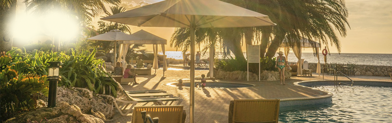
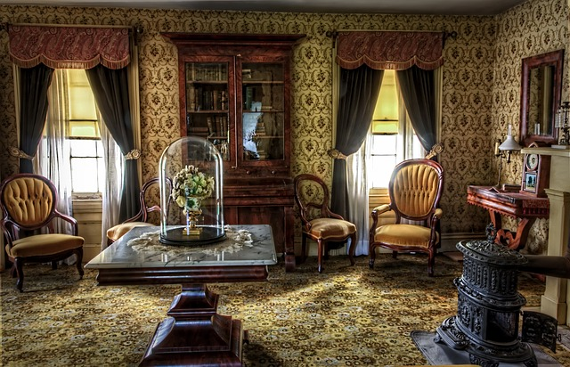
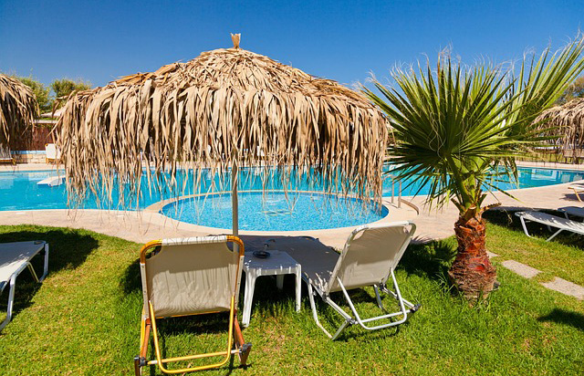

# 🏨 Hotel Chalé

Projeto de um site institucional para um hotel fictício, com foco em **HTML e CSS puro**, destacando estrutura de layout, responsividade mínima e design elegante inspirado em tons quentes.

---

## 📌 Descrição

O **Hotel Chalé** é uma página web que apresenta:

- Topo com **logo, menu de navegação, localização** e botão de reserva.
- Seção principal com **informações sobre o hotel**, incluindo:
  - Apartamentos
  - Restaurante
  - Piscina
- Rodapé simples com **direitos autorais**.

O layout é dividido em duas colunas principais, usando `float` e `positioning` para organizar os conteúdos.

---

## 🛠 Tecnologias

- HTML5
- CSS3
- Design responsivo mínimo (largura mínima e máxima definidas)
- Estrutura de layout **limpa e organizada**

---

## 📂 Estrutura de Arquivos

```
/Hotel-Chale
└───imagens/
│   README.md
│   estilo.css
│   index.html
```


---

## 💡 Funcionalidades

- **Menu de navegação:** Home, História, Imprensa, Gastronomia, Contato.
- **Seção de destaque:** Depoimentos e informações do hotel.
- **Seções de serviços:** Apartamentos, Restaurante, Piscina.
- **Design visual:** Uso de cores suaves, imagens ilustrativas e destaque em botões.

---

## 📸 Demonstração

  
  
  
  

---

## 🚀 Como usar

1. Clone o repositório:
```bash
git clone https://github.com/seu-usuario/hotel-chale.git
```

2. Abre o index no navegador

3. Abre o index no navegador

## ✨ Considerações -> Este projeto é ideal para:
```
Treinar HTML e CSS puro.
Criar páginas institucionais com layout dividido em colunas.
Melhorar o entendimento de posicionamento absoluto, floats e estilização de elementos.
```
